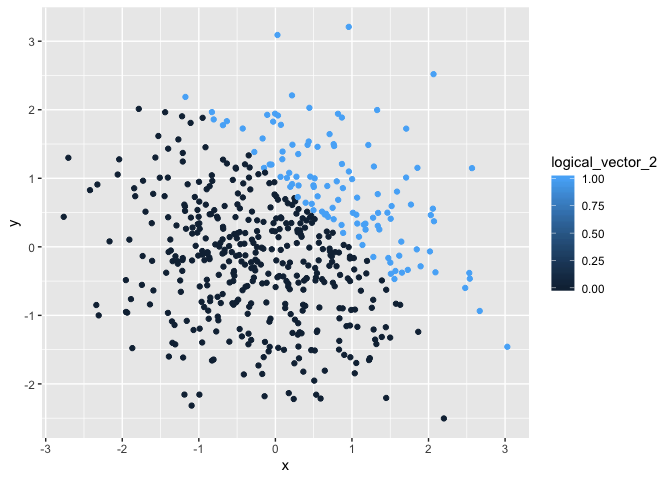
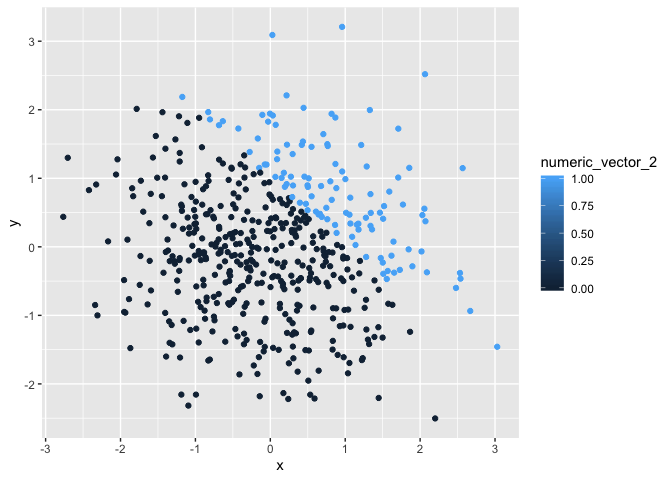
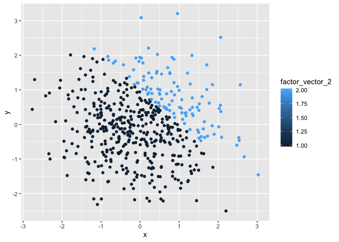

# Problem 1

Create a data frame comprised of:

* a random sample of size 8 from a standard Normal distribution
* a logical vector indicating whether elements of the sample are greater than 0
* a character vector of length 8
* a factor vector of length 8, with 3 different factor “levels”


```r
## create data frame
random_sample_1 = rnorm(8, mean = 0, sd = 1)
logical_vector = random_sample_1 > 0
character_vector = vector(mode = "character", length = 8)
list = c("red", "green", "blue", "blue", "blue", "blue","blue", "blue")
factor_vector = factor(list)
result_1 = data.frame(cbind(random_sample_1,logical_vector,character_vector,factor_vector))

## create mean of each variables
mean(random_sample_1)
```

```
## [1] -1.040826
```

```r
mean(logical_vector)
```

```
## [1] 0.25
```

```r
mean(character_vector)
```

```
## Warning in mean.default(character_vector): argument is not numeric or
## logical: returning NA
```

```
## [1] NA
```

```r
mean(factor_vector)
```

```
## Warning in mean.default(factor_vector): argument is not numeric or logical:
## returning NA
```

```
## [1] NA
```

```r
# I used 'rnorm' to produce random sample from standard normal distribution, used logical symbol '>' to create a list of logical values, used "vector" with mode character to create charater vector, and used "factor" to create factor vector. After these steps, I used "data.frame" to produce a data frama comprised of the previsou variables.
#Then I used "mean" function to get mean of each variable. It doesn't work for character vector or factor vector, and works for others. The reason is that character vector and factor vector are not numerica or logical, but others are.
```


```r
##change variables to numerical
logical_vector = as.numeric(logical_vector)
character_vector = as.numeric(character_vector)
factor_vector = as.numeric(factor_vector)

#Both logical vector and factor vector become numbers, but character vector turns into a list of NA value and the mean of NA values is NA.  This helps to explain. 
```


convert the logical vector to numeric, and multiply the random sample by the result
convert the logical vector to a factor, and multiply the random sample by the result
convert the logical vector to a factor and then convert the result to numeric, and multiply the random sample by the result


```r
logical_vector * random_sample_1
```

```
## [1] 0.00000000 0.03653165 0.80596637 0.00000000 0.00000000 0.00000000
## [7] 0.00000000 0.00000000
```

```r
factor(logical_vector) * random_sample_1
```

```
## Warning in Ops.factor(factor(logical_vector), random_sample_1): '*' not
## meaningful for factors
```

```
## [1] NA NA NA NA NA NA NA NA
```

```r
as.numeric(factor(logical_vector)) * random_sample_1
```

```
## [1] -0.54418421  0.07306331  1.61193274 -0.60875148 -2.44433364 -0.74124988
## [7] -2.53054518 -2.30004197
```

```r
#when logical vector converts to a factor, it can't multiply the random sample because it's not meaningful.
```

Problem 2

This problem focuses the use of inline R code, plotting, and the behavior of ggplot for variables of different types.

Create a data frame comprised of:
x: a random sample of size 500 from a standard Normal distribution
y: a random sample of size 500 from a standard Normal distribution
A logical vector indicating whether x + y > 1
A numeric vector created by coercing the above logical vector
A factor vector created by coercing the above logical vector

Make a scatterplot of y vs x; color points using the logical variable (adding color = ... inside of aes in your ggplot code should help). Make a second and third scatterplot that color points using the numeric and factor variables, respectively, and comment on the color scales.

Export your first scatterplot to your project directory using ggsave.


```r
## create data frame
x = rnorm(500, mean = 0, sd = 1)
y = rnorm(500, mean = 0, sd = 1)
logical_vector_2 = x + y > 1
numeric_vector_2 = as.numeric(logical_vector_2)
factor_vector_2 = factor(logical_vector_2)
data_frame_2 = data.frame(cbind(x, y, logical_vector_2, numeric_vector_2, factor_vector_2))

nrow(data_frame_2)
```

```
## [1] 500
```

```r
ncol(data_frame_2)
```

```
## [1] 5
```

```r
mean(x)
```

```
## [1] -0.01991041
```

```r
median(x)
```

```
## [1] -0.0003049349
```

```r
sd(x)
```

```
## [1] 0.9955771
```

```r
sum(logical_vector_2)/length(logical_vector_2)
```

```
## [1] 0.224
```

```r
#In this data frame,
#size is 500: 5 columes and 500 rows
#mean of X is 0.05303692
#median of x is 0.005256968
#standart deviation of x is 0.9847508
#the proportion of cases for which x + y > 1 is 0.272


## scatterplot of x and y
library(ggplot2)

ggplot(data = data_frame_2, aes(x = x, y = y, color=logical_vector_2)) + geom_point()
```

<!-- -->

```r
ggsave("scatter_plot.pdf", height = 4, width = 6)

ggplot(data = data_frame_2, aes(x = x, y = y, color=numeric_vector_2)) + geom_point()
```

<!-- -->

```r
ggplot(data = data_frame_2, aes(x = x, y = y, color=factor_vector_2)) + geom_point()
```

<!-- -->


